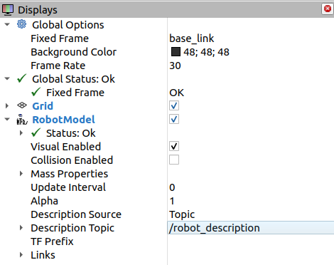
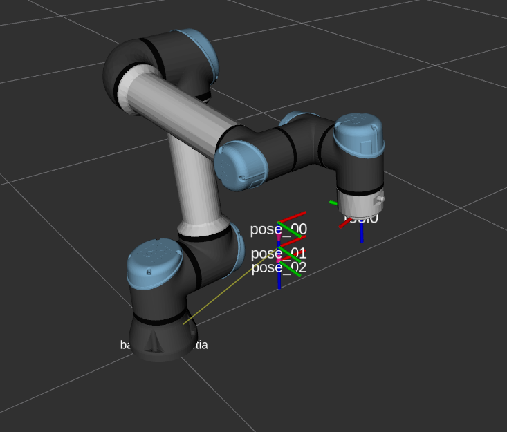
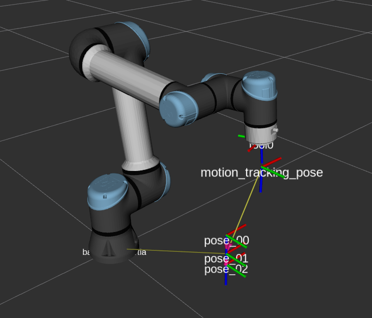
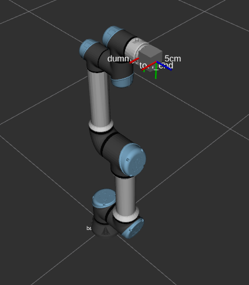
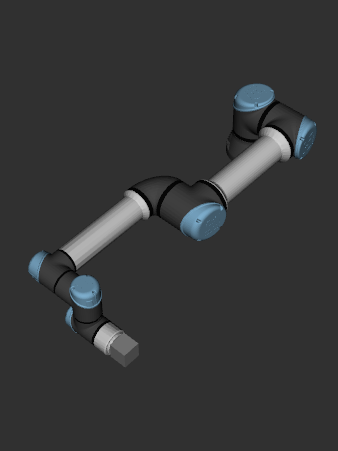

	<h1> UR5e ROS2 Real Robot Deploy</h1>
	
	
	
    
	  		

## Introduction

This repository serves a tutorial purpose to help bridge the gap in integrating UR robots with ROS 2 in real world by providing step-by-step instructions for deploying a UR5e robot across different applications and scenarios. 

It is primarily designed for the UR5e but should be able to adapt to other UR robot models.

### Repository Content:

*   **ur5e_robot_bringup**: To bringup the UR5e hardware control `ur_control` with locally configured urdf.xacro. 

*   **ur5e_robot_moveit_config**: Configurable for user-developed customzied tool. 

*   **moveit_control**: Prototype interface to control the robot arm to a **fixed pose** or **tracking a moving pose** `/target_pose`. 

*   **Instruction** to configure the urdf for customized task(s) or application(s).

## Requirements

1.  Moveit2 [[docs](https://moveit.picknik.ai/humble/index.html)]
    
        sudo apt install ros-humble-moveit-*`
    
2.  ur_robot_driver [[docs](https://docs.universal-robots.com/Universal_Robots_ROS2_Documentation/doc/ur_robot_driver/ur_robot_driver/doc/installation/installation.html)]

        sudo apt install ros-${ROS_DISTRO}-ur

## Getting Started

This section will describe steps to set up the and test run the packages using fake hardware (`use_fake_hardware:=true`) with the default urdf included in this repository.

### Setting Up the Workspace

Create a ros2 workspace `ros2_ws`

    mkdir -p ~/ros2_abc_ws/src 
    cd ~/ros2_public_ws/src
    git clone https://github.com/YJ0528/ur5e_robot_customized.git

Build the workspace:

    colcon build --symlink-install
    . install/setup.bash
    chmod +x ~/ros2_ws/src/ur5e_robot/moveit_control/moveit_control/online_target_pose.py
    chmod +x ~/ros2_ws/src/ur5e_robot/moveit_control/moveit_control/moveit_target_pose_control.py

*   `moveit_control` is a hybrid package containing executables(nodes) written in python and c++  
*   `chmod +x` to include the python scripts as executables. 
*   see [Create a ROS2 package for Both Python and Cpp Nodes](https://roboticsbackend.com/ros2-package-for-both-python-and-cpp-nodes/)

### Launch the Robot Bringup

1.  Run the launch file:

        ros2 launch ur5e_robot_bringup robot_bringup.launch.py \
        ur_type:=ur5e \
        robot_ip:=127.0.0.1 \
        use_fake_hardware:=true \
        launch_rviz:=true \
        description_package:=ur5e_robot_bringup \
        description_file:=ur5e.urdf.xacro \
        moveit_config_package:=ur5e_robot_moveit_config \
        launch_moveit_rviz:=true \
        initial_joint_controller:=scaled_joint_trajectory_controller

    *   Two Rviz windows will be created:

        *   view_robot
        *   moveit_rviz   

2.  In the `view_robot` window, set the display settings accordinly robot: 

    

    *   file -> save config to keep the displays config. 

3.  The `moveit_rviz` window should enable you to drag and move the robot to any random position using `Plan & Execute`.   

### Run moveit_control Node

The `moveit_control` package consisted two example implementation to control the robot using Moveit:

*   **moveit_target_pose_control**: To move the robot to a fixed pose registered under **tf** tree, without replanning.
*   **realtime_pose_tracking_node**: To trace a moving pose published in `/target_pose` topic, using IK defined in `moveit_config`. 
    *   An additional node `online_target_pose` to publish pose message to `/target_pose` separately.

Three dummy poses with preset pose `pose_00`, `pose_01`, `pose_02` are available for demo for both nodes, with an addition `motion_tracking_pose` avaialble for `realtime_pose_tracking_node`. 

  
  

*   tf tree comparision between `moveit_target_pose_control`(<-) and `online_target_pose`(->)

#### moveit_target_pose_control node

1. To run the node:

        ros2 run moveit_control moveit_target_pose_control.py

    
2.  Call the service to move the robot to the respective pose (choose one below):

        ros2 service call /go_to_pose_00 std_srvs/srv/Trigger
        
        ros2 service call /go_to_pose_01 std_srvs/srv/Trigger
        
        ros2 service call /go_to_pose_02 std_srvs/srv/Trigger

    **Demo:**

    <video controls src="media/moveit_target_pose_control.mp4" title="Title"></video>

#### realtime_pose_tracking_node

This implmenetaiton is a derivative work from [moveit realtime servo](https://moveit.picknik.ai/humble/doc/examples/realtime_servo/realtime_servo_tutorial.html), to allow:

*   Continuous tracking without termination (even when the end effector pose has aligned with the target pose) 

*   Relative motion tracking

*   Toggle of the ros2 controller from `scaled_joint_trajectory_controller` to `forward_position_controller` during runtime

Please refer to the repository: [moveit_servo](https://github.com/moveit/moveit2/tree/humble/moveit_ros/moveit_servo). 

The tracking is done using PID control; further tuning is required to achieve realtime level performance.

1.  To run the node:

        ros2 launch ur5e_robot_bringup pose_tracking.launch.py 
    

    *   to set the robot standby for the `/target_pose` topic message 

2.  To set up a moving node and publish in topic `/target_pose`:

        ros2 run moveit_control online_target_pose.py

    *   default pose published `/target_pose` is set to `motion_tracking_pose`, this is to track the relative motion of pose_01 (if pose_01 move forward, the robot move forward).

3.  **(Optional)** To change the tracking pose, change the parameter during runtime to set the node to publish differnet pose message to `/target_pose` topic (choose one below)"

        ros2 param set /online_target_pose target_pose "motion_tracking_pose"

        ros2 param set /online_target_pose target_pose "pose_00"
        
        ros2 param set /online_target_pose target_pose "pose_01"

        ros2 param set /online_target_pose target_pose "pose_02"

    **Demo:**

    <video controls src="media/target_pose_tracking_demo.mp4" title="Title"></video>

#### Additional Notes

1.   A topic `/pose` is included to accept pose message from other nodes. It is designed to serve as an interface accepting the pose message from the user implemented application (e.g. [foundation pose](https://github.com/NVlabs/FoundationPose) or motion capture system etc). To enable that, set the parameter `use_dummy_waypoints` to `false`.

2.  In `moveit_target_pose_control`, following topics are included in addition:

*   `/start` : to move the robot.

*   `/pause` : to pause the robot motion halfway, resume when start is toggled.

*   `/stop` : to stop the robot and terminate the MoveIt action.

    *   It uses some internal logic to pause the robot motion since MoveIt.

    *   The time delay to stop and resume the UR5e robot measured in a simple setup is about 110ms and 50ms respectively, given:
        *   Stop threshold = 0.01 rad/s 
        *   Arduino Uno R3
        *   Time measured from the moment signal is detected at Arduino until the UR5e robot joints velocity pass through the stop threshold

## Customoized Tool Implementation

This section will provide instrutions to modify the urdf to adapt your custom-built tool at the end effector `tool0`. 

### Introduction

In the `ur5e_ros2_real/ur5e_robot_bringup/urdf` folder, it should have a .xacro file `ur5e.urdf.xacro` for the robot hardware, and a urdf file `ur5e.urdf` for your moveit_config,  make sure the additional link(s) and joint(s) defined in those files matches each other.

*   The `ur5e.urdf.xacro` file is read by the robot hardware launch file  (`ur_control` or `ur5e_robot_bringup`);
*   The `ur5e.urdf` file is where the `moveit_config` takes reference from 

### Preparation

1.  3D models file of the tool in `.stl` and `.dae` format
2.  Move the files into the following directory:

    for .stl file:

        ~/ros2_ws/src/ur5e_ros2_real/ur5e_robot_bringup/meshes/collision

    for .dae file:

        ~/ros2_ws/src/ur5e_ros2_real/ur5e_robot_bringup/meshes/visual

### Demo Configuration in URDF  

There's a commented out content near the end of the `ur5e.urdf.xacro` and `ur5e.urdf` file. They are the demo implementation for reference purpose:  

     <!-- ===================== Customized Tool (attached to tool0) ===================== -->
  
    <!--   
    <link name="dummy_cube_5cm">
        <visual>
        <origin xyz="0 0 0.025" rpy="0 0 0"/>
        <geometry>
            <mesh filename="package://ur5e_robot_bringup/meshes/visual/dummy_cube_5cm.dae"/>
        </geometry>
        </visual>
        <collision>
        <origin xyz="0 0 0.025" rpy="0 0 0"/>
        <geometry>
            <mesh filename="package://ur5e_robot_bringup/meshes/collision/dummy_cube_5cm.stl"/>
        </geometry>
        </collision>
        <inertial>
        <mass value="0.2"/>
        <origin xyz="0 0 0.025" rpy="0 0 0"/>
        <inertia ixx="0.0000083" ixy="0" ixz="0" iyy="0.0000083" iyz="0" izz="0.0000083"/>
        </inertial>
    </link>

    <joint name="tool0_to_dummy_cube_5cm" type="fixed">
        <parent link="tool0"/>
        <child link="dummy_cube_5cm"/>
        <origin xyz="0 0 0" rpy="0 0 0"/>
    </joint>

    <link name="tool_end"/>
    <joint name="dummy_cube_5cm_to_tool_end" type="fixed">
        <parent link="dummy_cube_5cm"/>
        <child link="tool_end"/>
        <origin xyz="0 0 0.05" rpy="0 0 0"/>
    </joint>
    -->

1.  Uncomment the content in `ur5e.urdf.xacro` and launch the `ur5e_robot_bringup`, you will see a cube attached at the tool flange:

    

    *   A 5cm cube as a dummy attached at the tool flange `tool0`

2.  Likewise, uncomment the content in `ur5e.urdf` and launch the `setup_assistant`, to see the effect in moveit setup_assistant:

        ros2 launch ur5e_robot_moveit_config setup_assistant.launch.py

    

### Moveit Config Setup

Please refer to the previous section: [Demo Configuration in URDF](demo-configuration-in-urdf) to modify the urdf in comply with the custom-built tool that you wish to include.

1.  In the urdf, update the visual and collision mesh directory :

    from:

        filename="package://ur_description/meshes/ur5e/..."

    to:

        filename="package://ur5e_robot_bringup/meshes/..."

2.  Update the moveit config using moveit setup assitant: 

        ros2 launch ur5e_robot_moveit_config setup_assistant.launch.py

    Alternatively, create a new moveit_config package:

        ros2 launch moveit_setup_assistant setup_assistant.launch.py

    Please refer to the tutorial for [Moveit Setup Assistant](https://moveit.picknik.ai/main/doc/examples/setup_assistant/setup_assistant_tutorial.html).

3.  To check if the `ur5e.urdf` and meshes are in place:

        ros2 launch ur5e_robot_bringup display.launch.py

*   **Important Note**: Please ensure the urdf content for your custom-built tool is identical between `ur5e.urdf.xacro` and `ur5e.urdf`.

### Update Parameter in moveit_control Package

Update the following parameter according to the new `move_group` and `end_effector_name` defined during `setup_assistant`:

| .yaml Filename | Parameter to Update |
|----------|----------|
| `moveit_target_pose_control.yaml` | `planning_group`   `end_effector_link` |
| `pose_traclomg_settings.yaml` | `move_group_name`   `planning_frame`   `ee_frame_name`   `robot_link_command_frame` |  

## Real Robot Deploy

************************************************IMPORTNAT************************************************: 
Ensure a second person is present during robot operation and remains ready to activate the emergency stop at all times.

### Introduction

(It is an assumption I have yet validate) Each UR robot will have their kinematics uniquely calibrated when they are being manufactured/ assembled, while the urdf provided from `ur_description` only consisted of the default kinematics value (see `ur5e_robot_bringup/config/ur5e`).

### (Optional) Evaluate the Deviation

1.  Turn on and start the UR5e robot

2.  Ensure the workstation and the robot are within the same local area network (LAN), e.g. using a router

3.  Launch the `ur5e_robot_bringup` without the calibrated kinematics:

        ros2 launch ur5e_robot_bringup robot_bringup.launch.py \
        ur_type:=ur5e \
        robot_ip:={YOUR_ROBOT_IP_ADDRESS} \
        use_fake_hardware:=false \
        launch_rviz:=true \
        description_package:=ur5e_robot_bringup \
        description_file:=ur5e.urdf.xacro \
        moveit_config_package:=ur5e_robot_moveit_config \
        launch_moveit_rviz:=false \
        initial_joint_controller:=scaled_joint_trajectory_controller \
        
    *   replace {YOUR_ROBOT_IP_ADDRESS} to the actual robot ip address

4.  The disparity can be discovred by observing the end effector pose deteremined by ROS 2 and the robot Tool Center Point (TCP):

        ros2 run tf2_ros tf2_echo tool0 tool0_controller -p 5

    *   There will be a few mm deviation from its supposed value
    *   tool0_controller will only be discoverable when using the real robot  

### Retriving UR Robot Calibration File

1.  Turn on and start the UR5e robot

2.  Ensure the workstation and the robot are within the same local area network (LAN), e.g. using a router

3.  Open a new terminal, run the following command to retrive the calibration file:  

        ros2 launch ur_calibration calibration_correction.launch.py robot_ip:={your_robot_ip_address} target_filename:="${HOME}/my_robot_calibration.yaml"

    *   replace "${HOME}/my_robot_calibration.yaml" with your preferred location

### Update the Calibrated Kinematics in Moveit Config

With calibration file extracted, the user can launch robot hardware and control the robot accurately with its actual kinematics. Meanwhile, we also need to update the kinematics for moveit_config.  

However, the urdf that `ur5e_robot_bringup` uses (ur5e.urdf.xacro) to launch the robot hardware has a different format than the moveit setup assistant acccepts(to the best of my knowledge) -- it takes in parameters from config files as input instead of defining the value direclty inside the urdf. 

In this case, we have to extract a copy of the urdf.  

1.  Run the ur robot driver with the calibrated kinematics:

        ros2 launch ur5e_robot_bringup robot_bringup.launch.py \
        ur_type:=ur5e \
        robot_ip:={YOUR_ROBOT_IP_ADDRESS} \
        use_fake_hardware:=false \
        launch_rviz:=true \
        description_package:=ur5e_robot_bringup \
        description_file:=ur5e.urdf.xacro \
        moveit_config_package:=ur5e_robot_moveit_config \
        launch_moveit_rviz:=true \
        initial_joint_controller:=scaled_joint_trajectory_controller \
        kinematics_params_file:="${HOME}/my_robot_calibration.yaml"
    
    *   you can just run `ur_control` instead of running the whole bringup.   

2.  Retrive the urdf using `ros2 param get`:

        ros2 param get /robot_state_publisher robot_description --no-daemon | sed "s/^String value is: //" > ~/ros2_public_ws/src/ur5e_robot_customized/ur5e_robot_bringup/urdf/ur5e.urdf

3.  Subsequently, please refers to section: [Moveit Config Setup](moveit-config-setup) to update the moveit_config

    ************************************************IMPORTNAT************************************************: 
    If you wish to implement customized tool at your end effector, please refer to the section: [Customoized Tool Implementation](customoized-tool-implementation) before you proceed to the setup_assistant.

### Connect and Control the UR5e robot

Make sure the following is set:

*   All nodes are tested using fake hardware `use_fake_hardware:=false`
*   Robot's calibration file is retrived and updated to moveit config

1.  Turn on and start the UR5e robot

2.  Ensure the workstation and the robot are within the same local area network (LAN), e.g. using a router

3.  Run the ur robot driver with the calibrated kinematics:

        ros2 launch ur5e_robot_bringup robot_bringup.launch.py \
        ur_type:=ur5e \
        robot_ip:={YOUR_ROBOT_IP_ADDRESS} \
        use_fake_hardware:=false \
        launch_rviz:=true \
        description_package:=ur5e_robot_bringup \
        description_file:=ur5e.urdf.xacro \
        moveit_config_package:=ur5e_robot_moveit_config \
        launch_moveit_rviz:=true \
        initial_joint_controller:=scaled_joint_trajectory_controller \
        kinematics_params_file:="${HOME}/my_robot_calibration.yaml"

4.  Turn on the external control at the UR teach pendant. 

    *   For tutorial to install external control, please see: [Installing a URCap on a e-Series robot](https://docs.ros.org/en/humble/p/ur_robot_driver/doc/installation/install_urcap_e_series.html).
    
5.  Please refer to the [Run moveit_control Node](#run-moveit_control-node) section to control the robot.

## ROS 2 CLI Info

### Launch Scripts and Arguments

(draw a box of launch file -> nodes -> binary installed/ build from  source) 

| Launch script | Source     | Arguments | description |
|----------     |----------|----------| ---|
| `ur5e_robot_bringup.launch.py`     |  local   | `ur_type`   `robot_ip`   `use_fake_hardware`   `launch_rviz`   `description_package`   `description_file`   `moveit_config_package`   `launch_moveit_rviz`   `initial_joint_controller`   `kinematics_params_file` | includes:   `ur_control.launch.py`   `move_group.launch.py`   `moveit_rviz.launch.py` 
| `ur_control.launch.py`     | binary, installed `ur_robot_driver`     | N/A     | included in `ur5e_robot_bringup.launch.py` |
| `pose_tacking.launch.py`     | local     | N/A     | To set up the robot to standby for pose tracking   wait for pose message from `/target_pose` |
| `displau.launch.py`     | local     | N/A     | To read the robot description file from `ur5e.urdf` |

### Topics 

| Topic | Message Type | Node | Description |
|----------|----------|----------|----------|
| `/pose` | `PoseStamped` | `moveit_target_pose_control` \   `online_target_pose` \  | An interface to accept the pose message from the user implemented application |
| `/target_pose` | `bool` | `online_target_pose` \<pub>   `realtime_pose_tracking_node` \| Contain pose message to track by the robot | 
| `/start` | `bool` | `moveit_target_pose_control` \ | Signal to resume the robot from pause |
| `/pause` | `bool` | `moveit_target_pose_control` \ | Signal to pause the robot and MoveIt | 
| `/stop` | `moveit_target_pose_control` \ | Signal to stop the robot and exit the service  | 
| `trajectory_execution_event` | `String` | `moveit_target_pose_control` \<pub> | To stop the UR5e robot |  

### Services

| Service | Service Type | Node | Description |
|----------|----------|----------|----------|
| `/go_to_pose_00` | `std_srvs/srv/Trigger` | `moveit_target_pose_control` \<server> | Move the robot end effector to pose_00  |
| `/go_to_pose_01` | `std_srvs/srv/Trigger` | `moveit_target_pose_control` \<server> | Move the robot end effector to pose_01  |
| `/go_to_pose_02` | `std_srvs/srv/Trigger` | `moveit_target_pose_control` \<server> | Move the robot end effector to pose_02  |
| `/controller_manager/switch_controller` | `controller_manager_msgs/srv/SwitchController` | `moveit_target_pose_control` \<client>   `realtime_pose_tracking_node` \<client> | Activate and Deactivate ros2 controllers  |

### Parameter
| Parameter |  Description |
|----------|----------|
| `use_dummy_waypoint` |  to use a prefix pose, mainly for testing the code |
| `planning_group` | planning group for MoveIt |
| `end_effector_link` | the name of end effector link that MoveIt plan and move to the target pose |
| `motion_tracking_pose` | the name of end effector link that MoveIt plan and move to the target pose |
| `_orbit_radius` | orbit radius of the moving pose `pose_01`, in m, set to zero if `use_dummy_waypoint` is set to `true` |
| `_orbit_speed` | angular orbit speed of the moving pose `pose_01`, in rad/s, set to zero if `use_dummy_waypoint` is set to `true` |
| `dummy_x` | initial x position of pose_01 as dummy |
| `dummy_y` | initial y position of pose_01 as dummy |
| `dummy_z` | initial z position of pose_01 as dummy |
| `dummy_roll` | initial roll orientation of pose_01 as dummy |
| `dummy_pitch` | initial pitch orientation of pose_01 as dummy |
| `dummy_yaw` | initial yaw orientation of pose_01 as dummy |
| `move_group_name` | move group name for `realtime_pose_tracking_node` |
| `planning_frame` | The MoveIt planning frame for `realtime_pose_tracking_node` |
| `ee_frame_name` | The name of the end effector link for `realtime_pose_tracking_node`|
| `robot_link_command_frame` | The MoveIt planning frame |
`command_out_type` | Controller topic output message type std_msgs/Float64MultiArray, to control the joint position |

# Note

*   The moveit_target_pose_control is written using python, which I could not find a way to contro it using `cartesian path`. You may refer to the repository [here](https://github.com/loggcc/Moveit_ur5e_ros2-with-cartesian-path-planning/blob/main/ur5e_ws/src/moveit_control_pkg/src/cartesian_control.cpp) for an example implementation using c++.
*   If you wish to look up for more implementation of moveIt, see [hybrid_planning](https://moveit.picknik.ai/humble/doc/examples/hybrid_planning/hybrid_planning_tutorial.html).
*   If you wish to explore more about the moveIt servo performance under realtime, please refer to [Thread Priority](https://moveit.picknik.ai/main/doc/examples/realtime_servo/realtime_servo_tutorial.html#thread-priority).